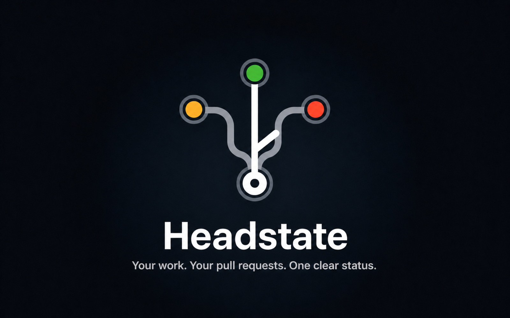

# Headstate

Headstate is a macOS desktop app that shows you the real state of every open
pull request you have across GitHub — one window, refreshed in the
background — so you can see what's blocked on you, what's blocked on someone
else, and what's ready to nudge, without opening a browser tab per repo.

It exists for one recurring moment: you want to ask a couple of colleagues
for reviews, and writing that Slack message by hand means re-checking each
PR's CI and merge status first. Headstate's nudge wizard turns "which PRs
need a nudge, and what's their state" into a paste-ready list in a few
clicks.



## Status

Headstate is early. v1 is deliberately **read-only** — it cannot merge,
comment, approve, close, or touch the merge queue. It only reads from
`api.github.com` and shows you what it finds.

## Prerequisites

- macOS.
- The [GitHub CLI](https://cli.github.com/), authenticated:

  ```
  brew install gh
  gh auth login
  ```

  Headstate reads your GitHub token from `gh auth token` at startup. If
  `gh` isn't installed or isn't logged in, Headstate shows you the same two
  commands on launch and won't proceed until they work — there is no
  separate login flow inside the app itself.

## Install

Download the latest `.dmg` or `.app.tar.gz` from the
[releases page](https://github.com/pktstorm/headstate/releases) and drag
`Headstate.app` into `/Applications`.

**v1 ships unsigned.** macOS Gatekeeper will refuse to open it with an
"unidentified developer" or "damaged" message. This isn't a bug — Headstate
just isn't code-signed or notarized yet (tracked in
[#23](https://github.com/pktstorm/headstate/issues/23)). Before first
launch, clear the quarantine flag:

```
xattr -dr com.apple.quarantine /Applications/Headstate.app
```

## What it shows

**Pull request list.** Every open PR you authored, across every repo you
have access to, in one list — the chrome mirrors GitHub's own
`<owner>/<repo>/pulls` view: filter by label (include *and* exclude —
GitHub's own UI only lets you include), review state, drafts, and sort
order.

**Priorities strip.** Pinned above the list: PRs blocked on *you* and
nobody else — real merge conflicts or failing CI — so the thing you need to
fix first doesn't get lost in a longer list. Quiet when nothing is blocked.

**Dashboard.** Seven stat cards — merged this week, merged this month, in
the merge queue, needs rebase or red CI, green and awaiting review, approved
and needs queueing, blocked by review comments. Every card is a triage
entry point: click one and the list view opens already filtered to match.

**Filters and repo sidebar.** A sidebar of repos with open PR counts, plus a
filter bar for labels, review state, and drafts.

**Nudge wizard.** A three-step flow — pick repos, pick which PRs qualify
(ready for review only, green CI only, needs-attention only, stale only),
then pick a text format — that produces a paste-ready block and copies it
to your clipboard. Nothing here calls GitHub; it only reads PRs already in
memory and formats them as text.

## Nudge output formats

The wizard composes plain text for pasting into Slack, a PR description, or
anywhere else. Every example below uses the `octocat` GitHub demo org.

**Flat markdown** (default, under the auto-group threshold):

```
- [octocat/hello-world#42] Add retry to the fetch client — https://github.com/octocat/hello-world/pull/42
- [octocat/spoon-knife#7] Bump the parser dependency — https://github.com/octocat/spoon-knife/pull/7
```

**Grouped by repo** (auto-enables at 3+ distinct repos, or toggle it
yourself), with status annotations on:

```
**octocat/hello-world**
- [#42] Add retry to the fetch client (green, approved) — https://github.com/octocat/hello-world/pull/42
- [#43] Fix flaky timezone test (CI failing) — https://github.com/octocat/hello-world/pull/43

**octocat/spoon-knife**
- [#7] Bump the parser dependency (CI running) — https://github.com/octocat/spoon-knife/pull/7
```

**Slack format**, grouped and annotated: Slack renders mrkdwn, not
markdown — a `[text](url)` link shows up as literal text there, and bold is
`*single asterisks*`, not `**double**`. That's why the Slack toggle exists;
it isn't cosmetic.

```
*octocat/hello-world*
- <https://github.com/octocat/hello-world/pull/42|#42> Add retry to the fetch client (green, approved)
- <https://github.com/octocat/hello-world/pull/43|#43> Fix flaky timezone test (CI failing)

*octocat/spoon-knife*
- <https://github.com/octocat/spoon-knife/pull/7|#7> Bump the parser dependency (CI running)
```

Status annotations, when enabled, are one of: `(CI failing)`,
`(needs rebase)`, `(draft)`, `(green, approved)`, `(green, awaiting review)`,
or `(CI running)`.

## Known limitations

- **Unsigned build.** See the Gatekeeper step above. Signing and
  notarization are tracked in
  [#23](https://github.com/pktstorm/headstate/issues/23).
- **Open PRs only.** Headstate's data comes entirely from your open pull
  requests; it does not track merge history. The "Merged this week" and
  "Merged this month" dashboard cards currently click through to the same
  open-PR list as every other card rather than a merged-PR view — see
  [#33](https://github.com/pktstorm/headstate/issues/33).
- **Tray badge isn't live yet.** The menu bar icon can show a count badge,
  but nothing currently feeds it a real "needs attention" number — it's
  always unbadged today.

## Development

Headstate is a [Tauri 2](https://v2.tauri.app/) app: a Rust backend
(`src-tauri/`, using the `octocrab` crate for the GitHub client and SQLite
for the local snapshot cache) and a React 19 + TypeScript + Tailwind 4 +
shadcn/ui frontend (`src/`), wired together with
[TanStack Query](https://tanstack.com/query) and Zustand.

Install dependencies with `yarn install --immutable`, then use the
Makefile for everything else:

```
make dev          # yarn tauri dev — run the app locally, live reload
make build         # yarn tauri build — produce a runnable .app / .dmg
make test          # both suites below
make test-rust     # cargo test (src-tauri)
make test-ui       # yarn vitest run
make lint          # both linters below
make lint-rust     # cargo fmt --check && cargo clippy -D warnings
make lint-ui       # yarn tsc -b --force && yarn eslint . && yarn knip
make fmt           # cargo fmt
make icons         # regenerate app + tray icons from the master PNG
```

**Do not run `cargo build --release` directly and expect a runnable app.**
See [CONTRIBUTING.md](CONTRIBUTING.md) for why — it's a real trap, not a
theoretical one.

CI (`.github/workflows/ci.yml`) runs the privacy guard, Rust formatting and
Clippy, TypeScript typechecking, ESLint, Knip, the full Rust test suite
(plus a 10x repeat to catch races), the frontend test suite, an app-bundle
build, and a supply-chain check (`cargo-deny` + `yarn npm audit`) on every
push and pull request. All of it must be green before merge.

## License

Apache-2.0. See [LICENSE](LICENSE).
